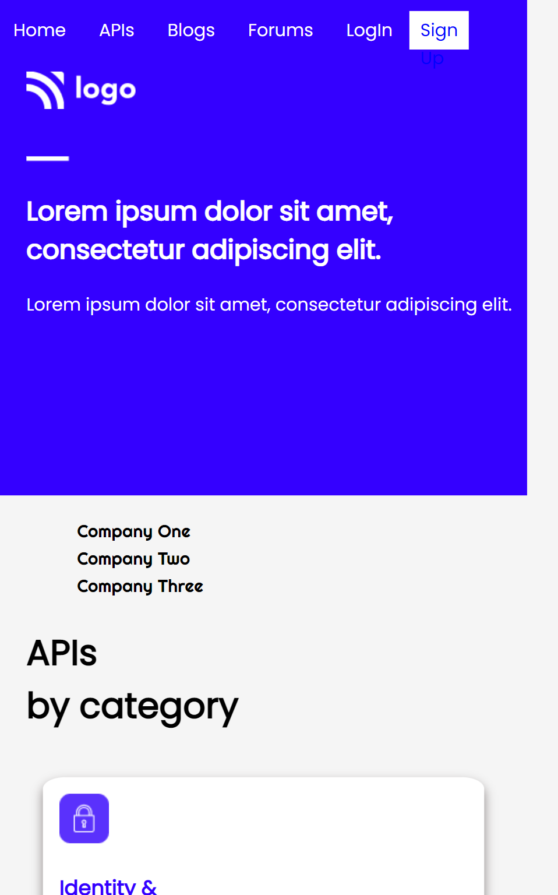

# Developer Landing Page [](http://www.gnu.org/licenses/agpl-3.0) [](http://www.gnu.org/licenses/agpl-3.0)

This is the full one page responsive website design of developer landing page made purely with HTML and CSS. It contains header,footer and 3 more sections.

## 🛠 Technologies Used

- HTML5 - Hyper Text Markup Language
- CSS3 - Cascading Spread Sheet

## Demo

[video.webm](https://user-images.githubusercontent.com/36806953/180946577-e6fec4ac-d4e6-4c54-b5a8-3534fb810f60.webm)

1. Desktop size


2. mobile size


## Run Locally

Clone the project

```bash
  git clone https://github.com/rakshitkoyani/Developer-Landing-Page.git
```

Go to the project directory

```bash
  cd Developer-Landing-Page
```

## Author

- [Rakshit Koyani](https://www.github.com/rakshitkoyani)
  - [](https://www.linkedin.com/in/rakshit-koyani-507040132/)
  - [](https://www.instagram.com/rakshitkoyani/)
  - [](https://www.twitter.com/rakshit_koyani)

## What I have learnt in this project

- I learn lots of things by building this one page website. Also improved my flexbox concepts. I solve the issue in blog section by reanalyzing the code and apply flex with position.
- Also learn how to put slider button after the flex section.

## Honest Time to finish the project

It took me around 7 hours to complete me this project.

## Live link of the project

https://rakshitkoyani.github.io/Developer-Landing-Page/
